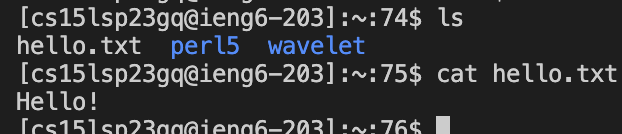

# Lab Report 1
## STEP 1: Installing VScode
- First, if using your personal laptop, you will need to download VScode at <https://code.visualstudio.com/> and follow the instructions. However, computers in the lab are also available and you can just open VS Code from there.
- Make sure to download the correct version for your laptop as it contains different versions for different operating systems such as macOS and Windows.
- When it is installed, go to VScode and open a new window which should look something similar to this (it may contain different colors or menu bar depeding on the system or settings): 

- You now have access to VS code!

## STEP 2: Remotely Connecting
- First, if you are using Windows, it is recommended to install git bash. Follow the instructions on <https://git-scm.com/downloads> to download git.
- Next, open a terminal in VScode by pressing on the 'Terminal' dropdown in the menu and then pressing 'New Terminal' just like this:

- Once you have opened a new terminal, you should get something similar to this:

- After the $ character in the terminal, you can connect to the remote server by typying in
  > **ssh cse15lsp23zz@ieng6.ucsd.edu**
- The **"zz"** that you notice should be replaced with the letters in your specific course account. If this is your first time loging in, your terminal might look something similar to this
  > **The authenticity of host 'ieng6-202.ucsd.edu (128.54.70.227)' can't be established.\
  > RSA key fingerprint is SHA256:ksruYwhnYH+sySHnHAtLUHngrPEyZTDl/1x99wUQcec.\
  > Are you sure you want to continue connecting (yes/no/[fingerprint])?**
- Type 'yes' and hit enter. Then your terminal should now ask for a password which is the password for your specific course account. Once you enter your password, your terminal should now look something similar to this:

- You are now connected to a remote server!

## STEP 3: Trying Some Commands
- Next, after you have connected to a remote server, you can try running some commands using the terminal which should now look something like this:

- After the $, try typing in some of these commands and view the output of the terminal:
  - cd ~
  - cd
  - ls -lat
  - ls -a
  - cat /home/linux/ieng6/cs15lsp23/public/hello.txt
- Your terminal should now have different outputs depending on the command that you ran.
  - Example of using ls -lat:
  
  - Example of using ls -s:
  
    - From this image, we are using the command 'ls -s' which prints the allocated size of each file in the current directory.
   
  - Example of using cat :
  - 
    - From this image, we are using the command 'cat hello.txt' which prints the contents of the file 'hello.txt'.
    - 'Cat' is used to print the context of a file that is given after it.

- Now, to log out of the remote server, you can type in 'exit' in the command on your terminal and you should now be logged out.
