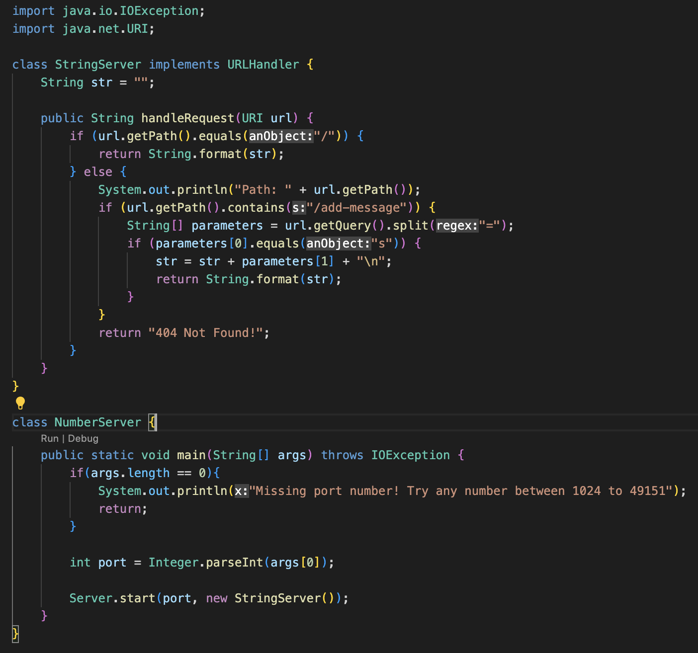
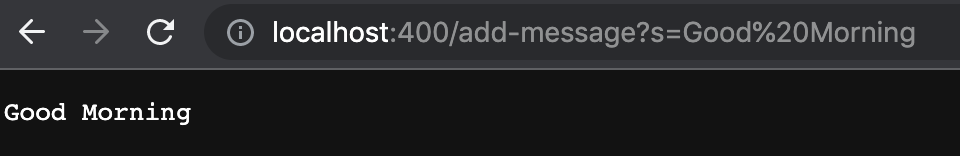
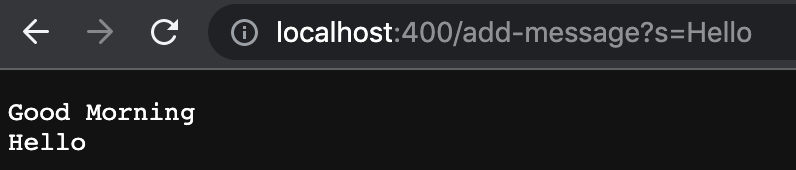

# Lab Report 2

## Part 1
Code for web server, StringServer:



Using /add-message:


- In my code for String Server, as I added the first message in the web server, the url.getPath() method and url.getQuery() method were called.
- The url.getPath() method was first called in order to check the "/add-message" request. After it did, it called the url.getQuery() method with the argument "s=Good Morning" in order to split at "=". The split was necessary in order to check the message after the "=" in order to respond with that string given.
- The first value of "str" was an empty string at first since we have not yet added anything. After the first "/add-message" was called, "str" now concataned with the message given after the "=". A new line message, "\n", was also given at the end therefore creating a new line after the given string was concataned with the other. Therefore the new "str" value was "Good Morning" with a new line after it.



- In the code, the url.getPath() and url.getQuery() methods were both called.
- The url.getPath() method first checked "/add-message" request. After it contained this request, it called the url.getQuery() method with the argument "s=Hello" in order to split at "=". After spliting, it checked the message after the "=" in order to respond with that string given and any other string that was already requested before this one. 
- The value of "str" before this method was called was "Good Morning" with a new line after it. However, after calling this method, "Hello" was concated with str but since there was a new line created with the previous request, "Hello" was given to a new line under "Good Morning". However, "Hello" was also concated with a "\n" at the end, therefore creating a new line after it. Therefore, the new "str" value was "Good Morning" and then "Hello" in a new line and a new line after "Hello".


## Part 2
```
public void testReverseInPlace2(){\
  int[] input = {10, 15, 20};\
  ArrayExamples.reverseInPlace(input);\
  assertArrayEquals(new int[] {20, 15, 10}, input);\
}
```


## Part 3

