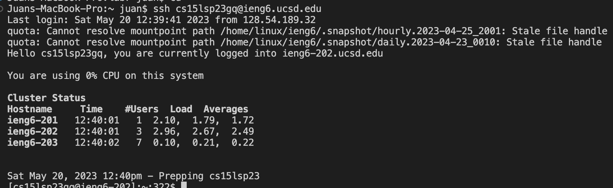
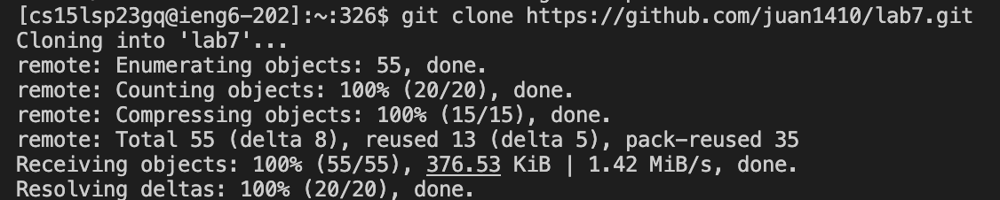
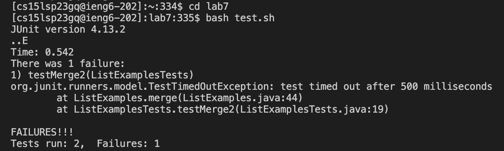
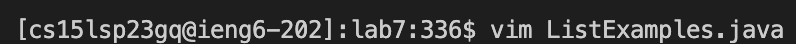
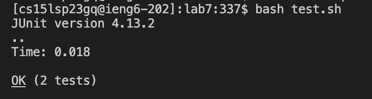

## Step 1: Log into ieng6

Keys Pressed: ** <up> <up> <enter> **
The ssh cs15lsp23gq@ieng6.ucsd.edu command was

## Step 2: Clone your fork into of the repository from your Github account

## Step 3: Run the tests, demonstrating that they failed

## Step 4: Edit the code file to fix the failing test

## Step 5: Run the test, demonstrating that they now succeed

## Step 6: Commit and push the resulting changes to your Github account

