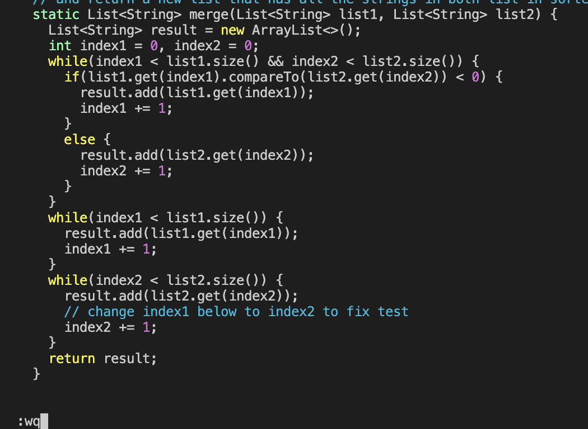

## Step 1: Log into ieng6

- Keys Pressed: _<**up**><**up**><**enter**>_ 
- The _**ssh cs15lsp23gq@ieng6.ucsd.edu**_ command was 2 up in my search history, so I used the up arrow twice to access it and log into ieng6.

## Step 2: Clone your fork of the repository from your Github account

- Keys Pressed: _<**Ctrl-R**><**g**><**Ctrl-E**><**SpaceBar**><**Command-V**><**enter**>_
- The _**git clone**_ command was already in my search history. So I used Ctrl-R and then typed the letter 'g' which gave me the result of git clone. Then I pressed Ctrl-E to go to the end of the line. After that I pressed the spacebar and then pressed Command-V to paste the URL of my repository. Then I hit enter to clone the repository from my Github account.

## Step 3: Run the tests, demonstrating that they failed

- Keys Pressed: _<**Ctrl-R**><**cd**><**enter**><**Ctrl-R**><**ba**><**enter**>
- First, I wanted to go into the lab7 directory. So I used Ctrl-R and then typed the letters 'cd' which gave the result of _**cd lab7**_ from my search history. Then I pressed enter to go into the lab7 directory. Once I was in the directory, I pressed Ctrl-R one more time and type the letters 'ba' which gave me the result of _**bash test.sh**_ from my search history. Then I pressed enter to run the tests.

## Step 4: Edit the code file to fix the failing test

- Keys Pressed: _<**Ctrl-R**><**v**><**enter**><**x**><**i**><<**2**><**esc**><**Shift-; + w + q**><**enter**>_
- 

## Step 5: Run the test, demonstrating that they now succeed

- Keys pressed: _<**up**><**up**><**enter**>_

## Step 6: Commit and push the resulting changes to your Github account

