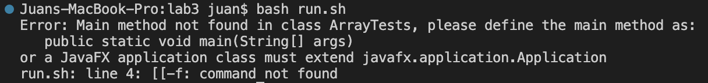
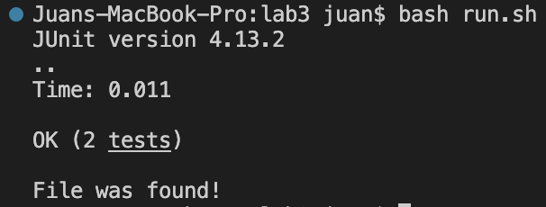

# Lab Report 5
## Part 1 - Debug Scenario
### Edstem Post
- _**What environment are you using?**_
    - I am using the VS Code terminal on a macbook.
- _**Detail the symptom you're seeing. Include both what you're seeing and what you expected to see.**_
    
    
    - I am expecting to see the file ArrayTests to be graded by Junit but is instead saying that there is not a main method in the file ArrayTests. I am also expecting for the bash script to print out "File was found!" since the file exists but I am getting an error saying that a specfic command in the bash script is not found.
- _**Detail the failure-inducing input and context**_
    - I have been compiling the bash script on the lab3 directory by running _**bash run.sh**_ which is the name of the bash script. I assume there might be something wrong in my if statanent in my bash script as the output says that the ArrayTests file exists but yet does not print "File was found!".

### Response From TA
Thanks for the details.
View how the first 2 lines in your bash script differ from here <https://ucsd-cse15l-s23.github.io/week/week3/#setup> 
You must have a space between the first brackets and the first command in the if statement as VS Code would consider the brackets as part of the command if there is no space in between.

### Screenshot/Terminal Output

There were 2 bugs in the code. The first one was that the second line in the bash script did not contain the 'org.junit.runner.JUnitCore' which is needed to use Junit. The second bug was that the '-f' and the first two brackets in the if statement had no space between each other which considered all of this as part of a command.

### Information needed about setup
- **File and directory structure needed**
- **Content of each file before fixing the bug**
- **The full command line that triggered the bug**
- **Description of what to edit to fix the bug**

## Part 2 - Reflection
